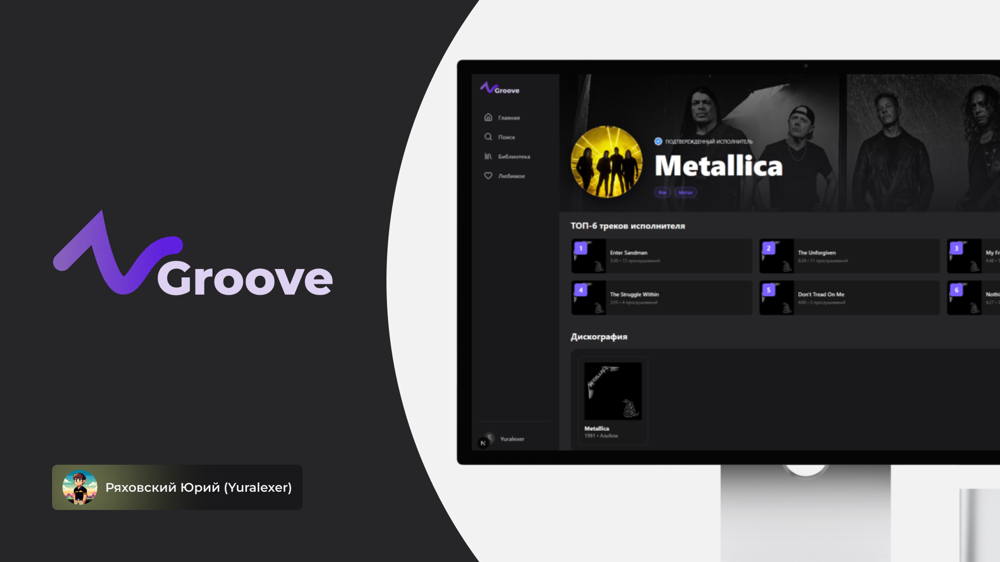

# 🎶Groove - музыкальный онлайн-сервис

Выполнил: студент РТУ МИРЭА группы ИКБО-20-23 **Ряховский Юрий Александрович (@Yuralexer)**

## 📄 Описание
Проект музыкального онлайн-сервиса. В нем реализован базовый функционал любого музыкального сервиса, включая прослушивание песен, просмотр альбомов, исполнителей, добавление треков в плейлист "Любимое", а также в другие плейлисты.



## 🤷‍♂️ Что где?
* **./backend/** - Django-проект, в котором реализовано API сайта.
* **./frontend/** - проект Next.js, где реализована клиенская часть сайта.
* **./docker-compose.yml** - специальный файл для сборки проекта и одновременного запуска нескольких контейнеров

## ▶️ Как запустить проект?
1. Для начала необходимо установить:
    * [Docker Desktop](https://www.docker.com/products/docker-desktop/)
    * [Python 3.12 (+pip)](https://www.python.org/)
    * Менеджер пакетов UV ```pip install uv```
    * [Node.js](https://nodejs.org/)
2. Убедиться, что в директориях ```./backend/``` и ```./frontend/``` присутствуют Dockerfiles. Также в дирекотрии ```./backend/``` должен быть файл ```entrypoint.sh``` для успешного запуска контейнера для API.
3. Убедиться, что **Docker** запущен на компьютере.
4. Находясь в директории проекта запустить docker-compose:

    ```bash
    docker-compose up --build
    ```

## 🤔 А что после запуска?
После запуска проекта вам доступно два порта для взаимодействия с сайтом:
* ```localhost:3000``` - фронтенд-часть сайта (Next.js)
* ```localhost:8000``` - API сайта (Django Rest Framework).
При необходимости остановить проект достаточно два раза нажать **Ctrl+C**, а для удаления контейнеров необходимо прописать команду:

    ```bash
    docker-compose down
    ```

## 🛣️ Какие пути проекта доступны?
### Для ```localhost:3000``` (Next.js):
* ```/``` - **Главная страница сайта**
* ```/account``` - **Страница управления аккаунтом**
* ```/album/[id]``` - **Страница обзора альбома по ID**
* ```/artist/[id]``` - **Страница обзора исполнителя по ID**
* ```/collection``` - **Страница любимых треков**
* ```/library``` - **Страница плейлистов пользователя**
* ```/login``` - **Страница входа в аккаунт**
* ```/playlist/[id]``` - **Страница обзора плейлиста по ID**
* ```/playlist/edit[id]``` - **Страница редактирования информации плейлиста по ID**
* ```/register``` - **Страница регистрации аккаунта**
* ```/search``` - **Страница поиска исполнителей, альбомов и треков**

### Для ```localhost:8000``` (Django Rest Framework):
* ```/admin``` - **Админ-панель Django.** Необходимо для добавления новых треков/альбомов/исполнителей и не только.
* ```/api/auth/...``` - **API для процессов регистрации, входа, изменения данных пользователя и удаление аккаунта**. Полные пути можно посмотреть 👉 [здесь](/backend/users/urls.py)
* ```/api/music/...``` - **API для работы с музыкальными объектами**. Полные пути можно посмотреть 👉 [здесь](/backend/music/urls.py)
* ```/api/playlists/...``` - **API для работы с плейлистами, включая плейлист "Любимое"**. Полные пути можно посмотреть 👉 [здесь](/backend/playlists/urls.py)

## 🪄 Как добавить админа?
Для открытия доступа к админ-панели Django необходимо создать **superuser'а**.

Для этого необходимо:
1. Убедиться, что контейнеры запущены (то есть проект запущен).
2. В отдельном терминале необходимо прописать команду:

    ```bash
    docker-compose exec -it backend uv run manage.py createsuperuser
    ```
    После чего необходимо следовать инструкциям в консоли для создания администратора.
3. Убедится, что после ввода всех необходимых данных в консоли отобразилось сообщение ```Superuser created successfully```.

После этого вы сможете войти в админ-панель, указав ранее введенные данные.

## 🎯 В каких целях был выполнен проект?
Проект был специально сделан для курсовой работы по дисциплине "Проектирование и разработка серверных частей интернет-ресурсов".